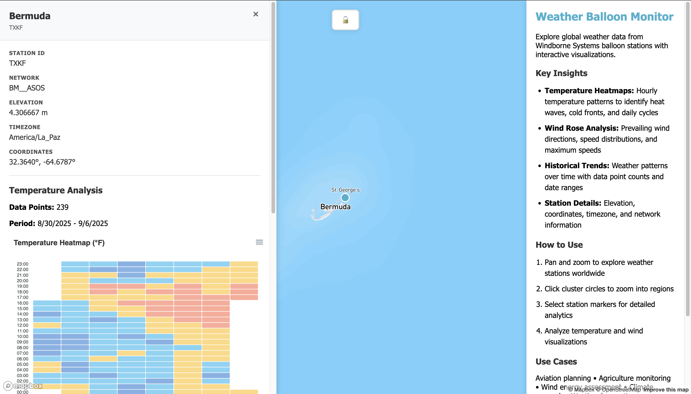

# 🎈 Weather Balloon Monitor

An interactive web application for exploring global weather data from Windborne Systems balloon stations with real-time visualizations and analytics.


## 📸 Screenshot



---

## ✨ Features

### 🗺️ Interactive Map
- **Global Coverage**: Explore weather stations worldwide with an interactive Mapbox-powered map
- **Smart Clustering**: Automatically groups nearby stations for better visualization at different zoom levels
- **Smooth Navigation**: Pan, zoom, and click to explore weather data seamlessly

### 📊 Advanced Analytics

#### Temperature Heatmaps
- **Hourly Patterns**: Visualize temperature variations across 24-hour periods
- **Historical Trends**: Track temperature changes over multiple days
- **Dynamic Color Scaling**: Automatically adjusts color ranges based on actual data
- **Interactive Tooltips**: Hover over any data point for detailed information

#### Wind Rose Analysis
- **Direction Distribution**: See prevailing wind directions across 16 compass points
- **Speed Categories**: Wind speeds grouped into 5 ranges (0-5, 5-10, 10-15, 15-25, >25 mph)
- **Statistical Summary**: Average speed, maximum speed, and prevailing direction
- **Polar Visualization**: Intuitive circular chart showing wind patterns

### 🔒 Simple Authentication
- **API Key Protection**: API key stored only in browser session storage
- **Session-Based**: Key persists until browser tab is closed
- **No Server Required**: All validation happens client-side
- **Easy Setup**: Just enter your API key when the app loads

### 📍 Station Details
- Station ID and network information
- Elevation and timezone data
- Precise GPS coordinates
- Historical data point counts
- Date range coverage

---

## 🚀 Getting Started

### Prerequisites

- A modern web browser (Chrome, Firefox, Safari, or Edge)
- A Mapbox API key ([Get one free here](https://account.mapbox.com/auth/signup/))
- A local web server or hosting platform

### Installation

1. **Clone the repository**
   ```bash
   git clone https://github.com/yourusername/weather-map.git
   cd weather-map
   ```

2. **Get a Mapbox API key**
   
   Sign up at [Mapbox](https://account.mapbox.com/auth/signup/) and get your free API key.

3. **Serve the application**
   
   Using Python:
   ```bash
   python -m http.server 8000
   ```
   
   Or using Node.js:
   ```bash
   npx http-server -p 8000
   ```

4. **Access the application**
   
   Open your browser and navigate to:
   ```
   http://localhost:8000/auth.html
   ```

5. **Enter your API key**
   
   When prompted, enter your Mapbox API key. It will be stored in your browser session.

---

## 📁 Project Structure

```
weather-map/
├── index.html          # Main application page
├── auth.html           # Authentication page
├── app.js              # Core application logic
├── config.js           # Configuration and API key hash
├── styles.css          # Application styles
├── assets/             # Images and icons
│   └── weather-balloon.png
└── README.md           # This file
```

---

## 🔧 Configuration

### API Key Security

The application uses a simple session-based approach:

1. **Session Storage**: Your API key is stored in browser session storage
2. **Session Lifetime**: Key persists until you close the browser tab
3. **No Transmission**: Your API key is never sent to any server except Mapbox's official API
4. **No Repository Exposure**: The key is never committed to your Git repository

### Customization

#### Modify Map Style

In `app.js`, change the Mapbox style:
```javascript
const map = new mapboxgl.Map({
  style: "mapbox://styles/mapbox/streets-v12", // or dark-v11, light-v11, etc.
});
```

---

## 🌐 Deployment

### GitHub Pages

1. **Push to GitHub**
   ```bash
   git add .
   git commit -m "Initial commit"
   git push origin main
   ```
2. **Enable GitHub Pages** in repository settings
3. **Set source** to main branch
4. **Access** at `https://yourusername.github.io/weather-map/auth.html`
5. **Enter your API key** when prompted

### Netlify

1. **Connect your repository** to Netlify
2. **Set build command**: (none needed)
3. **Set publish directory**: `/`
4. **Deploy**

### Vercel

```bash
vercel --prod
```

---

## 📊 Data Sources

- **Weather Data**: [Windborne Systems API](https://sfc.windbornesystems.com/)
- **Map Tiles**: [Mapbox GL JS](https://www.mapbox.com/)
- **Charts**: 
  - [ApexCharts](https://apexcharts.com/) for temperature heatmaps
  - [Highcharts](https://www.highcharts.com/) for wind rose diagrams

---

## 🎯 Use Cases

- **✈️ Aviation Planning**: Analyze wind patterns for flight route optimization
- **🌾 Agriculture Monitoring**: Track temperature and weather trends for crop management
- **💨 Wind Energy Assessment**: Evaluate wind resources for renewable energy projects
- **🔬 Climate Research**: Study long-term weather patterns and anomalies
- **🌤️ Weather Forecasting**: Access historical data for prediction models

---

## 🛠️ Technologies Used

- **Frontend Framework**: Vanilla JavaScript (ES6+)
- **Mapping**: Mapbox GL JS v3.15.0
- **Charting Libraries**: 
  - ApexCharts v3.x
  - Highcharts v11.x
- **Styling**: Custom CSS3 with modern features
- **Security**: Web Crypto API (SHA-256)

---

## 🔮 Upcoming Features

### 🤖 Interactive Chatbot
- AI-powered weather insights
- Natural language queries
- Pattern recognition and analysis

### ✈️ Flight Collision Analysis
- Real-time airplane tracking
- Collision risk assessment with weather balloons
- Safety alerts and notifications

---

## 🐛 Known Issues

- Large datasets may cause performance issues on older browsers
- Some stations may have incomplete historical data
- Wind rose requires sufficient data points for accurate visualization

---

## 🤝 Contributing

Contributions are welcome! Please follow these steps:

1. Fork the repository
2. Create a feature branch (`git checkout -b feature/AmazingFeature`)
3. Commit your changes (`git commit -m 'Add some AmazingFeature'`)
4. Push to the branch (`git push origin feature/AmazingFeature`)
5. Open a Pull Request

---

## 📝 License

This project is licensed under the MIT License - see the [LICENSE](LICENSE) file for details.

---

## 👤 Author

**Your Name**
- GitHub: [@yourusername](https://github.com/yourusername)
- LinkedIn: [Your Name](https://linkedin.com/in/yourprofile)

---

## 🙏 Acknowledgments

- **Windborne Systems** for providing weather balloon data
- **Mapbox** for the mapping platform
- **ApexCharts & Highcharts** for visualization libraries
- The open-source community for inspiration and support

---

## 📧 Contact

For questions or support, please open an issue or contact [your.email@example.com](mailto:your.email@example.com)

---

## 🔐 Security Note

**Important**: Your Mapbox API key is stored only in your browser's session storage and is never committed to the repository. The key is cleared when you close the browser tab. 

If you want to add additional security:
- Use Mapbox token URL restrictions in your [Mapbox account](https://account.mapbox.com/)
- Set usage limits on your token
- Rotate your API keys periodically

---

<div align="center">
  <p>Made with ❤️ and ☕</p>
  <p>⭐ Star this repo if you find it helpful!</p>
</div>
